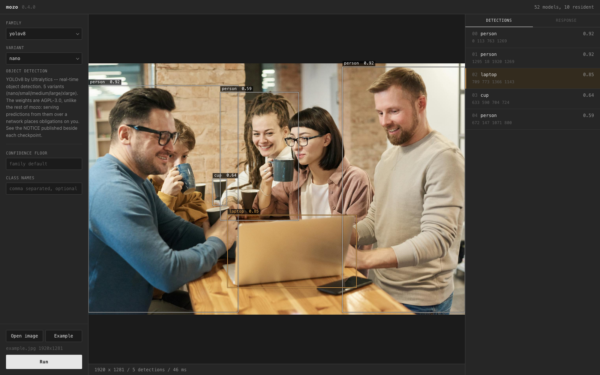

# Mozo

[](https://github.com/datamarkin/mozo/actions/workflows/ci.yml)
[](https://pypi.org/project/mozo/)
[](https://pypi.org/project/mozo/)
[](LICENSE)

### 73 computer vision models, and the workflows that run them.

One `pip install`. No dependency hell. Runs models, executes workflows, and builds them.

Normally each of these models arrives with its own package, and each package brings its own
dependencies — torch, numpy and OpenCV, every one pinned to something slightly different. Put a
few in one environment and something breaks. The usual escape is a container per model, and
paying for that forever.

Mozo ships none of them. Every model's inference path is vendored into mozo itself and verified
**bit-identical** to the original implementation — so one environment runs all 73, and gives
you the original's exact numbers rather than something close.

```bash
pip install mozo
mozo start
```

No Docker, no Kubernetes, no per-model build step, no conversion step, no `git clone` of
anything.

Serve from one install, in one process, behind one API.

A model on its own is rarely the job. Detect, then blur the faces, then save — that is a
**workflow**, and mozo runs those too: as a graph you draw in the browser, a JSON file you keep in
version control, or one call from Python. Same models, same process, no extra install.

## Model Catalog

### Object detection

| Family | Variants | Weights licence | Runtimes |
|---|---|---|---|
| `rfdetr` | `nano` `small` `medium` `large` | Apache-2.0 | torch, onnx, coreml |
| `yolov8` | `nano` `small` `medium` `large` `xlarge` | AGPL-3.0 | torch, onnx, coreml |
| `yolov11` | `nano` `small` `medium` `large` `xlarge` | AGPL-3.0 | torch, onnx |
| `yolov12` | `nano` `small` `medium` `large` `xlarge` | AGPL-3.0 | torch, onnx, coreml |
| `yolov26` | `nano` `small` `medium` `large` `xlarge` | AGPL-3.0 | torch, onnx |

Returns detections.

### Instance segmentation

A box and a mask per object, from one pass. Same families and same call as detection above — the
variant is what decides whether masks come back, so nothing else about the request changes.

| Family | Variants | Weights licence | Runtimes |
|---|---|---|---|
| `rfdetr` | `seg-nano` `seg-small` `seg-medium` `seg-large` | Apache-2.0 | torch, onnx, coreml |
| `yolov11` | `seg-nano` `seg-small` `seg-medium` `seg-large` `seg-xlarge` | AGPL-3.0 | torch |
| `yolov26` | `seg-nano` `seg-small` `seg-medium` `seg-large` `seg-xlarge` | AGPL-3.0 | torch |

Returns detections carrying a boolean mask each, at the source image's resolution.

### Text-prompted

| Family | Variants | Weights licence | Prompt |
|---|---|---|---|
| `grounding_dino` | `tiny` `base` | Apache-2.0 | descriptions, ≤256 tokens total |
| `owlv2` | `base` `base-ensemble` `large` `large-ensemble` | Apache-2.0 | phrases, ≤16 tokens |
| `sam3` | `sam3` | SAM License | phrases, ≤32 tokens |

Returns detections.

### Zero-shot classification and embeddings

Name your classes in words and each is scored against the image. The same model will also hand
back the vectors it works from, which is what makes a corpus embedded once searchable by words
afterwards — through a vector database of your own.

| Family | Variants | Weights licence | Prompt | Output |
|---|---|---|---|---|
| `clip` | `base` `base-16` `large` `large-336` | MIT | phrases, ≤77 tokens each | a score per phrase, or 512/768-d vectors |
| `siglip2` | `base-224` `base-256` `so400m-384` `so400m16-256` `giant-384` | Apache-2.0 | phrases, ≤64 tokens each | a probability per phrase, or 768/1152/1536-d vectors |

Scores are **cosine similarities, not probabilities**: not softmaxed, they do not sum to one, and
they may be negative. Nothing is filtered out — every phrase comes back scored, because a
classifier that drops a class has not classified.

The only family with a second route. `POST /encode/clip/base` returns the embeddings instead of an
answer, for images or for phrases; the towers load independently, so a job that only encodes images
never allocates the text half.

### Promptable segmentation

| Family | Variants | Weights licence | Prompt |
|---|---|---|---|
| `sam2` | `tiny` `small` `base_plus` `large` | Apache-2.0 | points, box, or both |
| `edgetam` | `edgetam` | Apache-2.0 | points, box, or both |

Returns detections, one row per mask.

### Text recognition

| Family | Variants (scripts) | Weights licence |
|---|---|---|
| `easyocr` | `english` `latin` `chinese-simplified` `japanese` `korean` | Apache-2.0 |

A variant is a script, not a language: `latin` alone covers 41 languages.

Returns detections, one row per line.

### Depth

| Family | Variants | Weights licence | Unit |
|---|---|---|---|
| `depth_anything_v2` | `small` | Apache-2.0 | relative, unitless |
| | `base` `large` | CC-BY-NC-4.0 | relative, unitless |
| | `indoor-` and `outdoor-`, three sizes each | Apache-2.0 | metres |

Returns an `HxW` float32 map.

Relative output is inverse depth on a per-image scale: larger is nearer, and no value is a
distance. `model.unit` says which, and is `None` rather than a guess.

How each family behaves and why — OWLv2 suppressing nothing, the encoder cache, EasyOCR's line
ordering, prompt semantics — is in [docs/models.md](docs/models.md).

## Install

```bash
pip install mozo
```

That is the whole install — twelve ordinary dependencies, not one of them a model package.

```bash
# Optional runtimes, for the families that publish those artifacts
pip install 'mozo[onnx]'     # onnxruntime
pip install 'mozo[coreml]'   # coremltools, macOS only
```

No family needs an extra. The extras add *ways to execute* a model, not models: without them
`runtime="auto"` simply does not select those artifacts.

## Using it

Three interfaces over the same models, plus two browser pages.

| | |
|---|---|
| **HTTP server** | serve models to other machines, or to a language that is not Python |
| **Python API** | build a pipeline, a script or a notebook, in-process |
| **Workflows** | wire models and image operations into a graph, and run it headless |
| *Test UI* | see what a model does to your own image before writing anything |
| *Workflow editor* | draw the graph, run it, watch each node finish |

### 1. HTTP server

```bash
mozo start
```

```bash
curl -X POST "http://localhost:8000/predict/rfdetr/medium" -F "file=@street.jpg"
```

```json
[
  {"bbox": [0.0, 113.24, 763.19, 1269.33], "class_name": "person", "confidence": 0.917},
  {"bbox": [709.0, 773.0, 1366.0, 1143.0], "class_name": "laptop", "confidence": 0.854}
]
```

Trimmed for reading. The real response carries every PixelFlow field on every detection —
`masks`, `segments`, `text`, `class_id`, `metadata` and the rest — including the ones that are
`null`, because `masks: null` beside a filled `segments` is a difference worth being able to see.

The catalogue is answerable without loading anything:

```bash
curl http://localhost:8000/models          # all 73, no torch import, no weights
curl http://localhost:8000/models/loaded   # what is resident right now
```

Full parameter reference below, and the server documents itself at
`http://localhost:8000/docs`.

### 2. Python API

```python
import mozo

model = mozo.get_model("rfdetr/medium")

for found in model.predict("street.jpg"):
    print(found.class_name, found.confidence, found.bbox)
#   person 0.92 [0.0, 113.24, 763.19, 1269.33]
#   laptop 0.85 [709.0, 773.0, 1366.0, 1143.0]
```

`predict` takes a path, encoded bytes, or an RGB array, and returns a unified PixelFlow `Detections` —
iterable, indexable, and the same shape from every family here.

```python
# Ask for something in words
model = mozo.get_model("owlv2/base-ensemble")
found = model.predict("kitchen.jpg", ["kettle", "a mug", "the window"])
found[0].class_name          # 'kettle' — the phrase you searched for

# Read the text on a sign
model = mozo.get_model("easyocr/english")
found = model.predict("sign.jpg")
found[0].text                # 'EXIT 42' — what it says
found[0].class_name          # None — OCR reads content, it does not pick a class

# Measure depth
model = mozo.get_model("depth_anything_v2/indoor-small")
depth = model.predict("room.jpg")    # HxW float32, at the input's resolution
model.unit                           # 'metres' — or None, and then it is not a distance
```

### Try it in the browser

```bash
mozo start        # then open http://localhost:8000/test-ui
```



Pick any of the 73, run it on your own image, and see the response two ways at once: drawn on
the image, and as the raw PixelFlow record. Hovering a box lights its row and its JSON, so when
something lands somewhere surprising its numbers are one click away.

### 3. Workflows

A workflow is a graph of nodes in a JSON file. Draw it at `/workflow`, or write it by hand; run it
from Python, from the command line, or over HTTP.

```python
from mozo.workflow import Workflow

results = Workflow.load("blur_faces.json").run(image="street.jpg")
```

```bash
mozo run blur_faces.json --image street.jpg
```

38 nodes: every model family, the image transforms and annotations PixelFlow provides, and the two
ends that read and write files. A node is an ordinary Python function — its signature *is* its
declaration, so what the editor offers you and what actually runs cannot disagree:

```python
@node(category="Annotate")
def draw_boxes(image: Image, detections: Detections, thickness: int | None = None) -> Image:
    """Draw a box around each detection."""
    return pf.annotate.box(image.copy(), detections, thickness=thickness)
```

Connections are typed. A port carrying detections cannot be wired into one that takes an image, and
the editor refuses it before anything runs. Adding a node is adding a function.

## Verification

Vendoring a model normally means maintaining something that quietly drifts from the original. The
whole claim above rests on that not happening, so it is checked rather than asserted — **with no
tolerance.** Exact equality, because a tolerance hides precisely the drift a check exists to catch.

The gates in `tools/verify/` compare every intermediate stage against the original implementation,
not just the final answer: 1,275 comparisons for EasyOCR, 226 for OWLv2, 138 for Grounding DINO,
every one identical. Twelve of the fourteen families ship one; all fourteen have their parity measured
and recorded in
`mozo/vendors/<family>_deploy/PROVENANCE.md`, with the upstream commit it was built from.

Because the extraction *is* the implementation rather than a wrapper around one, none of this
costs anything at run time: EasyOCR runs within 1% of the published package on the same weights.

## HTTP API

```http
POST /predict/{family}/{variant}
Content-Type: multipart/form-data
```

| Parameter | Applies to | Meaning |
|---|---|---|
| `file` | all | The image. Required. |
| `threshold` | detection, text-prompted | Confidence floor. Omitted, the family's own published default applies — they differ, and the endpoint deliberately does not restate them. |
| `labels` | detection | Comma-separated class names overriding the model's own. |
| `text` | text-prompted | The concept to look for. Required by those families. Repeat it for several. |
| `point`, `label` | promptable | A click as `x,y`, and `1` to include or `0` to exclude. Repeat both together. |
| `box` | promptable | A box as `x1,y1,x2,y2`. May be combined with points. |
| `name` | promptable | What to call what you pointed at. |
| `multimask` | promptable | Three candidate masks rather than one. Default `true`. |

`text` is deliberately not comma-separated the way `labels` is: a prompt is free text, so
`?text=a person, holding a mug` stays one concept rather than becoming two wrong ones. `label` is
required with `point` and has no default — guessing between include and exclude returns a
confident mask of the wrong thing.

```bash
# Boxes for anything you can name, under a permissive licence
curl -X POST "http://localhost:8000/predict/owlv2/base-ensemble?text=kettle&text=a%20mug" \
  -F "file=@kitchen.jpg"

# Click one thing: three candidate masks, best first
curl -X POST "http://localhost:8000/predict/edgetam/edgetam?point=820,640&label=1" \
  -F "file=@street.jpg"

# A box, one mask, named by you
curl -X POST "http://localhost:8000/predict/sam2/tiny?box=40,60,300,480&multimask=false&name=cat" \
  -F "file=@street.jpg"
```

Depth answers with an image rather than JSON:

```bash
curl -X POST "http://localhost:8000/predict/depth_anything_v2/indoor-small" \
  -F "file=@room.jpg" -D headers.txt --output depth.png

# depth.png is a 16-bit PNG; headers.txt carries what it means:
#   X-Depth-Unit: metres | none      X-Depth-Min / X-Depth-Max: the endpoints
#   depth = min + png / 65535 * (max - min)
```

16-bit rather than 8, because six of the nine variants predict metres and quantising those to 256
levels would discard the measurement.

CLIP is the one family with a second route. `/predict` classifies; `/encode` returns the vectors
instead of an answer, for images or for phrases but not both in one call:

```bash
# Score an image against phrases you make up
curl -X POST "http://localhost:8000/predict/clip/base?text=a%20forklift&text=a%20person" \
  -F "file=@aisle.jpg"

# The vectors themselves, to put in a vector database of your own
curl -X POST "http://localhost:8000/encode/clip/base" -F "file=@aisle.jpg"
curl -X POST "http://localhost:8000/encode/clip/base?text=a%20forklift&text=a%20person"
```

The response carries `model` and `revision` alongside the embeddings, and those are not decoration:
a vector is only comparable against others from the same weights, so a stored index is tied to them.

The other endpoints: `GET /` for health and residency, `GET /models` for the catalogue,
`GET /models/loaded` for what is in memory, `GET /test-ui` for the browser page, and `GET /docs`
for the generated OpenAPI reference.

## Python API

`mozo.get_model` uses one process-wide cache. When you want a separate lifetime — a batch job
that should release its models at the end — build your own manager and drop it:

```python
from mozo import ModelManager

models = ModelManager()
model = models.get_model("rfdetr", "medium", device="cpu")

scratch = ModelManager()      # a separate lifetime; drop it and its models go with it
```

`device` takes `"cuda"`, `"mps"`, `"cpu"`, or `None` to take the best available.

### Your own checkpoints

Fine-tuned weights load through the same API, on architectures mozo supports:

```python
model = models.get_model(
    "rfdetr", "my-training",
    checkpoint_path="runs/best.pth",
    model_size="small", project_type="detection",
    labels=["hardhat", "vest"],
)
```

Everything that changes what gets built is part of the cache identity — a checkpoint, a pinned
revision, a runtime — so two people's `my-training` are two models rather than one.

### PixelFlow

Every detection family returns the same object, so filtering and annotation are written once:

```python
import pixelflow as pf

found = model.predict(image)
filtered = found.filter_by_confidence(0.8).filter_by_class_id([0, 2])

annotated = pf.annotate.box(image, filtered)
annotated = pf.annotate.label(annotated, filtered)

json_output = filtered.to_json()
```

More: [PixelFlow](https://github.com/datamarkin/pixelflow)

## How it works

**Nothing loads until it is asked for.** The server starts instantly whatever is published, and
the first request for a family downloads and loads it. That first request is slow — minutes, for
a multi-gigabyte family on a cold cache — and every one after it is not.

**Nothing is evicted.** A model stays for the life of the process. This is deliberate: an earlier
version bounded the cache by model count, and a count cannot tell 0.10 GB from 1.34 GB. The same
number could not be right for a 6 GB laptop and an 80 GB accelerator, and measured, it broke the
obvious deployment — detection, segmentation and depth from one instance, 0.60 GB between them —
into a 762 ms eviction on every request. **Memory is yours to manage, and the lever is which
models you ask for.**

**A model is built once** however many requests arrive for it at the same moment, and a request
for a model already in memory never waits behind an unrelated load.

**Weights resolve from a manifest that ships inside the package**, so working out which bytes a
model refers to needs no network and no configuration. Every artifact is verified by sha256 after
download, and its licence and a NOTICE naming the exact upstream release are published beside it.

## Configuration

| Variable | Meaning |
|---|---|
| `MOZO_ENABLE` | Which models this server offers, comma-separated. A family (`clip`) or one variant (`clip/base`); mix freely. Unset offers everything. An allow-list, so an upgrade that adds a family does not start serving it unasked. A name that matches nothing is logged and ignored, never fatal — it can only subtract. |
| `MOZO_CACHE` | Where downloads live. Default `~/.cache/mozo`. |
| `MOZO_BASE_URL` | Serve artifacts from a mirror instead of the manifest's. A `file://` URL pointing at a `weights/` tree works, which is how an air-gapped host can be fed from removable media. |
| `MOZO_OFFLINE` | Set to `1` to refuse downloads. A missing file raises an error naming the exact path, URL and hash, so it can be placed by hand. |
| `PYTORCH_ENABLE_MPS_FALLBACK` | Set to `1` on Apple silicon so unimplemented ops fall back to CPU rather than failing. |

## Deploying

```bash
mozo start                      # 0.0.0.0:8000
mozo start --port 8080
mozo start --workers 4          # read the note below first
mozo start --reload             # development; forces one worker
```

It is a real server — FastAPI on uvicorn, thread-safe, with weights verified by hash — and three
things about it are yours to arrange:

- **`--workers N` multiplies memory by N.** Workers are separate processes and share nothing, so
  each loads its own copy of every model it serves. Four workers serving SAM 3 is four times
  3.4 GB, not one. Prefer one worker unless you have measured otherwise.
- **There is no authentication and no rate limiting**, and the default bind is `0.0.0.0`. Put it
  behind something before it faces a network you do not control.
- **Nothing is evicted**, so a process asked for every family will eventually hold every
  family. Decide what an instance serves rather than letting callers decide for it —
  `MOZO_ENABLE` is how, and it is also how the licence question below is answered.

## What mozo does not do

- **No training and no fine-tuning.** Bring a checkpoint; mozo runs it.
- **No video, no tracking, no streams.** One image per request. Object tracking is deliberately
  absent from workflows for the same reason: it is stateful across frames, and mozo has no frames.
- **No batching.** One image per forward, which is what keeps results bit-identical.
- **No model conversion.** ONNX and CoreML artifacts are published where a family exports
  cleanly, and where it does not, mozo says so rather than shipping a graph that disagrees.
- **It is not a model hub.** The catalogue is a curated 73, chosen because each one could be
  extracted and verified. Growth is deliberate and slow.

## Extending

1. Write an adapter in `mozo/adapters/your_model.py`
2. Register it in `mozo/registry.py`
3. It is available over HTTP, in Python, and in the test UI
4. Add a node in `mozo/workflow/nodes/model.py` — one function — and it joins the editor's palette

Workflow nodes are the same idea one level up: a function with annotated arguments in
`mozo/workflow/nodes/`, and the catalogue, the editor's form and the type checking all follow from
it.

```
HTTP request → FastAPI server → ModelManager → Adapter → Vendor
                                     ↓
                               thread-safe cache
```

The rule that keeps this honest: **a vendor imports no other vendor and never imports mozo.**
Duplication between vendors is deliberate, so a family can be re-extracted from a newer upstream
release without touching anything else. `tests/test_vendor_agreement.py` enforces it, and each
vendor's `PROVENANCE.md` records the exact upstream commit it came from and what was changed.

## Development

```bash
pip install -e .
mozo start --reload
pytest
```

The workflow editor is a Svelte app in `ui/`. Its build output is committed, so npm is needed to
*change* it and never to install mozo:

```bash
cd ui && npm install && npm run build   # writes mozo/workflow/static/
```

## Links

- [Repository](https://github.com/datamarkin/mozo)
- [Issues](https://github.com/datamarkin/mozo/issues)
- [PixelFlow](https://github.com/datamarkin/pixelflow) — the result format

## License

Mozo's own code is **Apache-2.0**, and so is every vendored extraction under `mozo/vendors/`.

The weights are separate works travelling with it. Of the 73 published variants, **36 are
Apache-2.0**, 30 are **AGPL-3.0** (every YOLO variant), 4 are **MIT** (CLIP), 2 are
**CC-BY-NC-4.0** (Depth Anything `base` and `large`), and 1 carries Meta's **SAM License**
(SAM 3). The full licence and a NOTICE
naming the exact upstream release are published beside every checkpoint.

**YOLO weights are AGPL-3.0**, or covered by a commercial licence from Ultralytics.
And serving predictions from them over a network places  AGPL-3.0 section 13 obligations on you.

Complying with either is the operator's responsibility. `MOZO_ENABLE` is how an instance declines
to take it on — a server that never offers a model never fetches or serves its weights:

```bash
MOZO_ENABLE=clip,easyocr,edgetam,grounding_dino,owlv2,rfdetr,sam2,siglip2,\
depth_anything_v2/small,depth_anything_v2/indoor-small,depth_anything_v2/indoor-base,\
depth_anything_v2/indoor-large,depth_anything_v2/outdoor-small,\
depth_anything_v2/outdoor-base,depth_anything_v2/outdoor-large
```

That is the 40 Apache-2.0 and MIT variants, and it stays 40 through an upgrade that adds
families — which a list of what to *exclude* would not. Depth Anything is named variant by variant
because it is the one family whose licence is not uniform: seven of its nine are Apache-2.0 and
two are CC-BY-NC-4.0.

Nothing here relicenses anything. It only decides what one deployment hands out.
